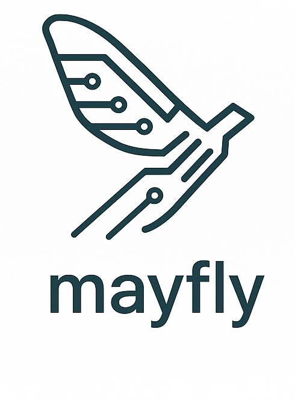

# Mayfly

<p align="center">
  
</p>

**AI OS in a Process**

---

Mayfly is a coroutine-first, modular scheduling engine—originally the internal kernel for Tiffany — now evolving independently as a lightweight, pluggable microkernel for AI agents. It provides a scalable, extensible execution environment for ephemeral, concurrent jobs across coroutine, async, threaded, and multiprocess engines, aiming to be the core of agent runtimes, simulation systems, and intelligent orchestration.

Mayfly isn't just a job runner — it's a scheduler, runtime, and reasoning substrate for concurrent agent cognition.

---

## 🧬 Origin

Mayfly originated as the internal kernel of the Tiffany cognitive agent system, extracted as a standalone engine to be reused across Microscaler’s agent stack. Designed by Charles Sibbald and the Microscaler core team, it embodies the ethos of resilience, composability, and minimalism.

Its job model was shaped by decades of microkernel, actor, and AI research — and designed to scale from embedded AI to cloud-scale distributed cognition.

Mayfly is a runtime to think with.

Thanks go to [David Beazley](https://www.dabeaz.com/) for inspiration on coroutine scheduling, and to the Erlang/OTP team for their pioneering work on lightweight processes and distributed systems.

---

## ✨ Vision

> Mayfly will be the AI OS in a process: orchestrating tasks, reasoning steps, perception cycles, and distributed cognition with the same elegance as a real-time microkernel.

Inspired by both Erlang and modern distributed systems, Mayfly enables:

* Thousands of lightweight jobs across coroutine, thread, or process engines
* Structured lifecycle control of tasks (spawn, yield, sleep, wait, cancel)
* Local reasoning and global coordination
* Simulation of time, planning, and agentic flow
* Federated agent behavior across mesh environments

---

## 🧭 Runtime Modes

Mayfly can operate in two modes:

### 🧬 Embedded Mode (default)

* Used within Tiffany or another embedding runtime
* Scheduler is instantiated and controlled programmatically
* No external I/O or listening ports

### 🌐 Daemon Mode (distributed/multi-node)

* Mayfly runs as a **long-lived process** (e.g., container, microVM, system service)
* Accepts jobs via IPC, gRPC, or A2A messages
* Exposes `/metrics`, `/__health`, and remote scheduling endpoints
* Ideal for:

    * Distributed execution clusters
    * Mesh-based agent platforms
    * Fault-tolerant job infrastructure

The `mayfly-daemon` crate encapsulates this mode and acts as a node within a larger mesh or scheduler topology. It is optional but provides flexibility for infrastructure scenarios.

---

## 🚫 Scope and Boundaries

As Mayfly evolves, we intentionally constrain its scope to avoid bloating and role confusion. It is critical to ensure Mayfly remains a **focused execution kernel** — not a domain-specific orchestrator or reasoning engine.

### ❌ Mayfly does **not** think

* No LLMs
* No decision trees
* No goal resolution or planning logic

Cognition belongs in Tiffany or an upstream agent orchestration layer.

### ❌ Mayfly does **not** manage workflows or strategies

* No pipelines or behaviors
* No rules or scheduling policies based on domain semantics
* It only knows **how** to run tasks, not **why**

### ❌ Mayfly does **not** include domain-specific task types

* No understanding of tasks like "summarize", "plan", "analyze"
* All jobs must conform to abstract, pluggable `SchedulableJob` traits

### ❌ Mayfly is **not** a message bus

* It does not provide pubsub, event queues, or general messaging
* It relies on external systems (gRPC, QUIC, A2A) for ingress/egress

### ❌ Mayfly does **not** handle user auth or identity

* No tokens, sessions, ACLs, or roles
* All security concerns are handled by edge components

### ✅ Mayfly *only* guarantees:

* Execution of jobs on local or remote engines
* Observability of those jobs
* Lifecycle control (spawn, yield, sleep, wait, cancel, retry)
* Minimal, agentic coordination (task routing, offloading, stealing)

> Think of Mayfly like the kernel in an OS. It runs things, manages time and memory, but never makes decisions about applications, users, or goals.

---

## 🔧 Features

### ✅ Current (from Tiffany Scheduler)

* Green-threaded **coroutine task execution** using `may`
* Unified **SystemCall** interface (sleep, yield, spawn, wait, etc.)
* **WaitMap**: arbitrary-key blocking and waking
* **ReadyQueue**: fair, prioritized task queue
* **Clock** abstraction: monotonic and wall time
* Local task spawning, lifecycle, retry logic
* Task IDs, states, backoff, and metrics

## 🛠️ Roadmap Highlights

* [ ] Modular **execution engines**: Coroutine / Async / Threaded / Process
* [ ] **Supervisor trees** and structured task graphs
* [ ] **Simulated time kernel** for predictive planning
* [ ] **Metrics + tracing** for observability
* [ ] **Pluggable job protocols** (A2A, JSON-RPC, LLM-Chat)
* [ ] **WASM task engine** + sandboxing
* [ ] **Distributed runner mesh** with auto-routing and resilience
* [ ] **Work stealing + offloading** for dynamic load redistribution
* [ ] **Daemon runtime** for remote execution, IPC/gRPC interfaces, and cluster behavior

### 🧭 Roadmap

### v0.2

* Coroutine engine refactor
* Public crate split from Tiffany

### v0.3

* Async + threaded execution engines
* Tracing + Prometheus metrics

### v0.4

* A2A Protocol job interface
* Simulated time + replayable plans

### v0.5

* Distributed runner mesh
* Fault detection + migration
* Work stealing + offloading
* Job deduplication + supervision


---

## 🕸️ Distributed Runner Mesh

Mayfly nodes can operate cooperatively in a decentralized mesh:

* Each runner manages its own task queues and engines
* Jobs can be routed to other nodes based on:

    * Hashing (job ID, queue, agent key)
    * Load metrics
    * Engine capability (GPU, WASM, etc.)
* Supports:

    * Gossip-based runner discovery
    * Job forwarding and task migration
    * Node failure detection + recovery

### 🤹 Work Stealing and Offloading

To maintain balance across the mesh:

* **Work stealing**: underutilized nodes **pull** tasks from busy peers
* **Work offloading**: overloaded nodes **push** tasks to idle peers

Key principles:

* Steal from the **tail** (oldest or lowest priority)
* Offload when local thresholds exceeded (CPU, queue depth, memory)
* Track origin + lineage for observability and traceability
* Serialize tasks into transferable job envelopes

Planned metrics:

* `mayfly_jobs_forwarded_total`
* `mayfly_jobs_stolen_total`
* `mayfly_job_origin{node_id="..."}`

This enables:

* **Horizontal scaling**
* **Hot code mobility**
* **Workload recovery** from partial failures

---

## 🔗 A2A Protocol Support (Agent-to-Agent Communication)

Mayfly integrates with the [A2A Protocol](https://a2aprotocol.ai) to support agent-native communication:

* Incoming jobs can be submitted as A2A `task.submit` or `goal.propose` messages
* Internal Mayfly jobs can emit `a2a.result`, `a2a.intent`, or `a2a.plan.execute`
* Runner mesh communication can optionally use signed A2A messages for:

    * Job forwarding
    * Agent-to-agent delegation
    * Result propagation

This enables:

* Full interop with LangChain, AutoGen, and other A2A-compatible agents
* Human-inspectable agent message logs
* Verifiable, typed intent exchange between distributed Mayfly runtimes

---

## 🧩 Architecture

### Core Modules

* `task.rs` — task lifecycle, `TaskId`, `TaskState`, `TaskWaker`
* `syscall.rs` — abstract system calls (`Sleep`, `WaitOn`, `Spawn`, etc.)
* `scheduler.rs` — queue execution loop + syscall dispatcher
* `wait_map.rs` — dynamic signal blocking/waking map
* `ready_queue.rs` — priority scheduler queue
* `pal/` — platform abstraction layer
* `clock.rs` — time simulation + wall time
* `engine/` — coroutine, async, threaded, process (extensible)
* `mesh.rs` (planned) — distributed runner coordination + routing
* `a2a.rs` (planned) — message parsing, validation, schema translation


---

## 🚀 Usage Example

```rust
use mayfly::prelude::*;

struct MyJob;

impl SchedulableJob for MyJob {
    fn run(&self) -> Result<(), JobError> {
        println!("Running cognitive task");
        Ok(())
    }
}

fn main() {
    let sched = Scheduler::builder()
        .register_queue("default")
        .build();

    sched.submit("default", MyJob);
    sched.run_blocking();
}
```

---

## 🔌 Engine Types

| Engine    | Description                 | Use Case                        |
| --------- | --------------------------- | ------------------------------- |
| Coroutine | `may`-based green threads   | Reasoning, planning, simulation |
| Async     | Rust futures + event loop   | Streaming, network ops          |
| Threaded  | Native threads (Rayon etc)  | Parallel CPU tasks              |
| Process   | Subprocesses, WASM, plugins | Isolation, security, plugins    |

---

## 📊 Observability + Metrics

* `mayfly_tasks_total{status="completed"}`
* `mayfly_task_latency_seconds`
* `mayfly_queue_depth{queue="default"}`
* `mayfly_syscall_counts{type="wait"}`
* `mayfly_jobs_forwarded_total`
* `mayfly_jobs_stolen_total`
* `mayfly_job_origin{node_id="..."}`
* Planned: OpenTelemetry + log correlation

---

## 🧪 Testing & Validation

* Property-based task and queue testing
* Load tests across thousands of tasks
* Time simulation + determinism
* Distributed mesh convergence simulation
* Fault injection for node failure recovery

---

## 📦 Crate Layout

```
mayfly/
├── src/
│   ├── lib.rs
│   ├── task.rs
│   ├── syscall.rs
│   ├── scheduler.rs
│   ├── ready_queue.rs
│   ├── wait_map.rs
│   ├── clock.rs
│   ├── pal/
│   ├── engine/
│   ├── mesh.rs (planned)
│   └── a2a.rs (planned)
```

## Tiffany Daemon CLI

The `tinkerbell` binary exposes a few flags for customizing the runtime:

| Flag | Description |
| ---- | ----------- |
| `--concurrency <N>` | Number of worker threads to spawn |
| `--quantum <ms>` | Scheduling quantum in milliseconds |
| `-v`, `--verbose` | Increase logging verbosity (use `-vv` for trace) |
| `--dump-state` | Emit a scheduler snapshot on shutdown |


---

## 📘 License

MIT OR Apache 2.0

---
